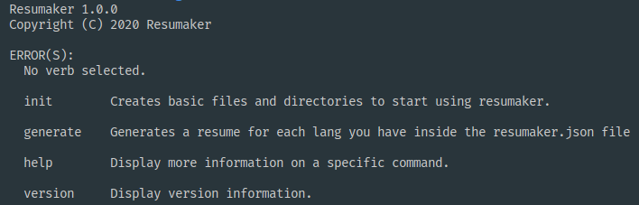
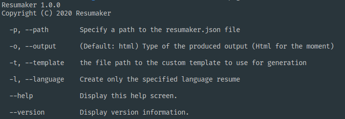

[scriban]: https://https://github.com/lunet-io/scriban

# Resumaker CLI



## Usage

### Binary

Download the binary and put it on your PATH then start generating your resume, you can also get help on the commands just execute
`resumaker help generate` that should show you the following text


### .Net tool

This is also available as a dotnet global tool

```
dotnet tool install --global Resumaker
```

By default resumaker-cli will try to look for the `resumaker.json` file wherever you invoke the tool. If that file is not present there's the handy `init` command which will create the file for you with A couple resumes of some ghost pokemon trainer.

You can of course remove everything there and start from scratch, a [json-schema](https://json-schema.org/) is [provided](https://github.com/AngelMunoz/Resumaker/blob/master/resumaker.schema.json), if your editor supports `json-schema`, it should give you examples and kind of validate the data inside your `resumaker.json` file

To generate your output files you should use the `generate` command (the help output is above) and that's it! edit your json file and re-generate your Resume :)

## resumaker.json

The `resumaker.json` file has a schema and there are a few conventions around it, the object keys must be UpperCase every property is required (at least for the default template) even if it is empty, the Language Name should be a valid locale language string for example

- en-US
- en-GB
- es-MX
- es-ES
- fr-FR
- fr-CA

Specially if you are generating an HTML file which sets the Language of the html document

## Custom Templates

If you are fancier than me, you can use a custom template if you specify the flag `-t|--template` when you use the `generate` command for the templating language I used [Scriban] which is quite fast and very simple to use, check the [default.html](https://github.com/AngelMunoz/Resumaker/blob/master/templates/default.html) file to base any template you might want to customize

### Notes and Variables

when customizing your template shape, the variable names will be transformed into lower_snake_case by the scriban template engine so for example A profile in json would be like this (this is just a sample, the correct template can be found at [resumaker.sample.json](https://github.com/AngelMunoz/Resumaker/blob/master/resumaker.sample.json) or using the `init` command)

```json
{
  "Language": {
    "Name": "en-US",
    "Keywords": { "Skills": "Skills" }
  },
  "Profile": { "Name": "Frank" },
  "Skills": [{}],
  "PreviousJobs": [{}],
  "Projects": [{}],
  "DevLinks": [{}],
  "SocialMedia": [{}]
}
```

these will be available inside the template as

```html
<h1>{{ this.profile.name }}</h1>
<!-- outputs  <h1>Frank</h1> -->
```

The `Keywords` property inside `Language` is parsed as a `string, string` dictionary so the names will be kept, you can access them like this

```html
<h1>{{ this.language.keywords['Skills'] }}</h1>
<!-- outputs  <h1>Skills</h1> -->
```

and if you are looking to Fully customize the whole template including the defaults I guess you could abuse the `Language.Keywords` property since it just ouputs the string but Idealy you should just put keywords there instead of the contents

### Motivations

I was updating my resume when word decided to screw all of my margins/order/text and what not so I decieded that I could perhaps create a tool for my resume that fits my needs, in the end is a simple blank page with text so Why not to use HTML ([Scriban]) templates if I ever wanted to update my resume it would be as simple as writing a couple of entries in a json file.
